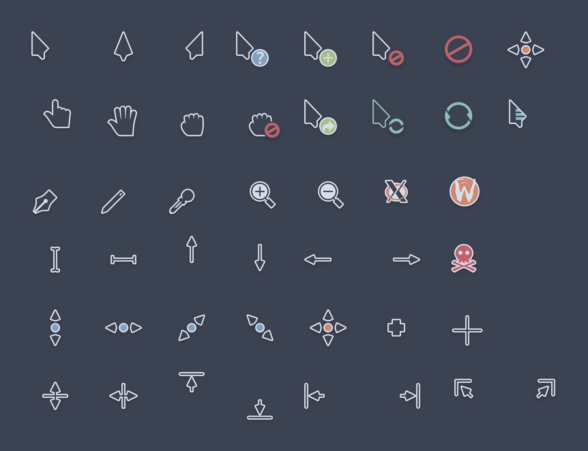

# Nordic Cursors Scalable

> Forked from [Nordic Theme by Eliver Lara](https://github.com/EliverLara/Nordic)

Nordic Cursors Theme for KDE, but also build with scalable SVG variants and
with more choices in sizes.

<p align="center">
  
</p>

---

Total changes compared to original Nordic Cursors Theme (2.2.0):

- Added scalable SVG cursor files for all cursor shapes
- Added more sizes for legacy XCursor (3 -> 26 available sizes from 12px to
  96px)
- Changed scale factor for XCursor files from 1.25 to 4/3 to be the same as
  KDE Breeze
- Updated aliases to account for some new cursors that were added to Breeze
  since the last update to Nordic Cursors, fixes issues with some specific
  Adwaita Apps

## Installing

### KDE Store

Install via _"Get new…"_ dialog in _System Settings_ > _Colors & Themes_ > _Cursors_
and search for _"Nordic Cursors Scalable"_.

### Manual

Download `nordic_cursors_scalable.tar.xz` from the 
[latest Release](https://github.com/Flachz/Nordic-Cursors-Scalable/releases/latest)
(or build it yourself with the instructions below).

Install via _"Install from file…"_ dialog in _System Settings_ > _Colors & Themes_ > _Cursors_.

Or manually extract the archive into `~/.local/share/icons/` or `~/.icons/`, for
example by running:

```sh
tar xf ~/Downloads/nordic_cursors_scalable.tar.xz -C ~/.local/share/icons
```

## Building

To build the theme `xcursorgen` and `inkscape` packages are required. The
build script expects a GNU based system.

Run `build.sh` inside the project root directory. You may also set 
`THREADS` env var to manually limit rendering threads, if not set
all available CPU threads will be used.
